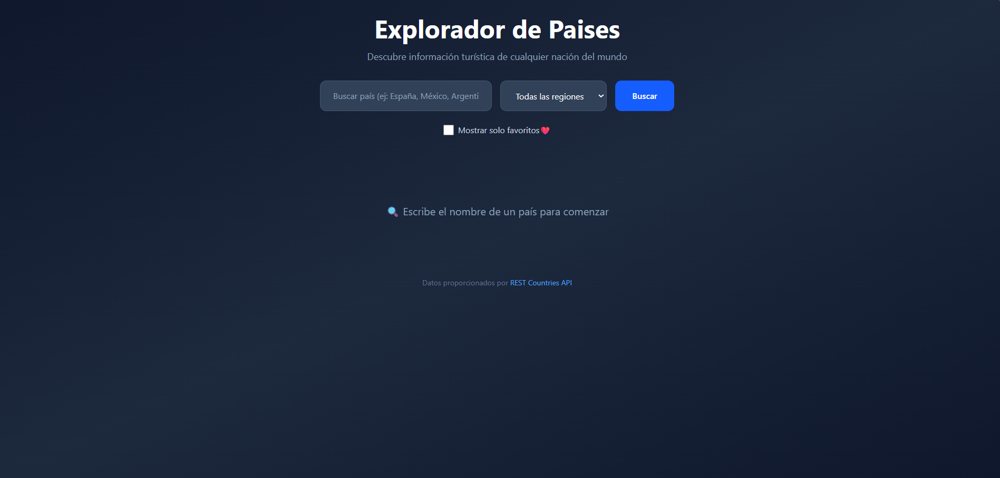
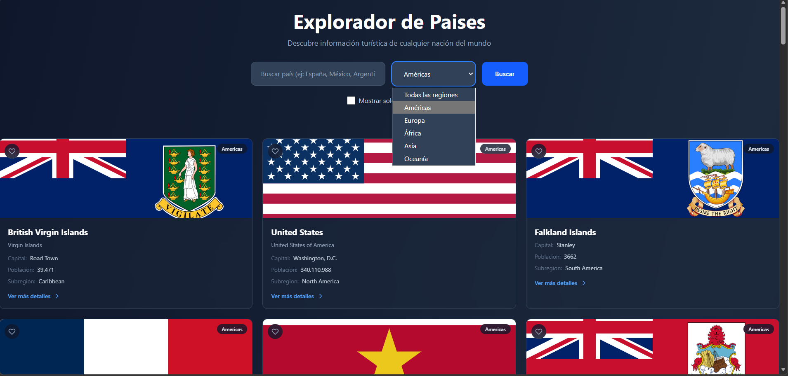
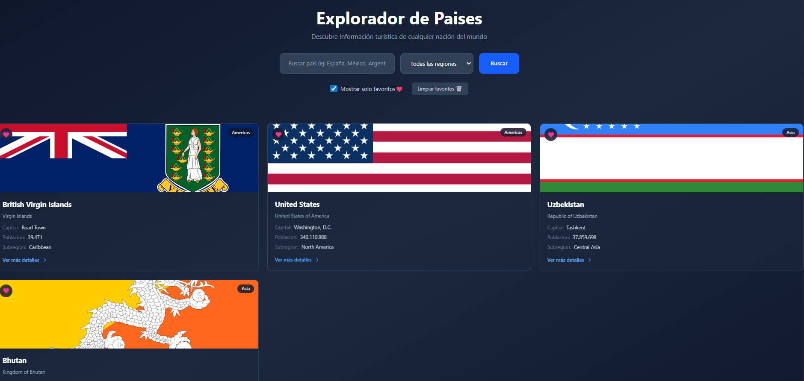

# 🌍 Country Explorer (Explorador de Países)

Una aplicación web moderna y rápida para explorar información turística y demográfica de todos los países del mundo. Construida desde cero **sin frameworks** (Vanilla TypeScript) para dominar los fundamentos web, el manejo del DOM y la arquitectura de estado.

## ✨ Características Principales

* **Búsqueda Inteligente:** Encuentra países por nombre en tiempo real, optimizado con *debounce* para no saturar la API.
* **Filtrado por Región:** Explora continentes específicos (Américas, Europa, Asia, África, Oceanía).
* **Sistema de Favoritos (Persistente):** Marca los países que te interesan. Tus selecciones se guardan en la memoria del navegador (`localStorage`) para que no se pierdan al recargar.
* **Filtros Combinados:** Cruza datos buscando por nombre, región y mostrando únicamente tus favoritos, todo al mismo tiempo.
* **Manejo de Estados UI:** Experiencia de usuario fluida con pantallas específicas para estado de carga (Loading), sin resultados (Empty/No Results), errores de conexión y mensajes dinámicos.
* **Diseño Responsivo y Moderno:** Interfaz elegante en modo oscuro construida con Tailwind CSS 4.
* **Accesible (a11y):** Soporte para navegación por teclado (Enter/Espacio) y atributos ARIA para lectores de pantalla.

## 🛠️ Tecnologías Utilizadas

* **Lenguaje:** TypeScript (Vanilla)
* **Estilos:** Tailwind CSS v4
* **Estructura:** HTML5 Semántico
* **Herramientas de Construcción:** Vite
* **Consumo de Datos:** Fetch API nativa
* **API Externa:** [REST Countries API](https://restcountries.com/)

## 🏗️ Arquitectura del Proyecto

El proyecto sigue un patrón de diseño basado en componentes funcionales (Factory Function Pattern) y un estado global de UI (`UiState`), separando claramente las responsabilidades:

```text
src/
├── components/      # Funciones que generan UI (CountryCard, CountryModal)
├── services/        # Lógica de comunicación con la API (countryApi)
├── types/           # Interfaces y tipos de TypeScript (Country, UiState)
├── utils/           # Utilidades reutilizables (DOM, formateo, favorites)
├── styles/          # Archivos de estilos (Tailwind)
└── main.ts          # Punto de entrada, event listeners y controlador de estado
```

## 🚀 Instalación y Uso Local

Para correr este proyecto en tu máquina local, sigue estos pasos:

1. **Clona el repositorio:**
   
```bash
git clone [https://github.com/tu-usuario/country-explorer.git](https://github.com/tu-usuario/country-explorer.git)
```
   
2. **Navega a la carpeta del proyecto:**
   
```bash
cd country-explorer
```

3. **Instala las dependencias:**
```bash
npm install
```

4. **Inicia el servidor de desarrollo:**
```bash
npm run dev
```

5. **Abre tu navegador en la ruta que te indique la terminal (generalmente http://localhost:5173).**


## 🧠 Aprendizajes Clave

Este proyecto sirvió para poner en práctica:

* **Tipado estricto con TypeScript** aplicándolo directamente al DOM (`HTMLInputElement`, encadenamiento opcional, Type Assertions).
* **Promesas y consumo asíncrono** (`async/await`) manejando correctamente los bloques `try/catch`.
* **Manejo avanzado de arrays** (`filter`, `some`, `findIndex`) para la lógica de búsqueda cruzada.
* **Rendimiento web** mediante el uso de `DocumentFragment` para renderizar listas y `debounce` para inputs de texto.
  ##

<div align="center">
<h2> Imagen Preview antes de las modificaciones </h2>

</div>

<div align="center">
  <h2> Resultado Final </h2>

  

  

  

</div>

Link al video explicativo:
